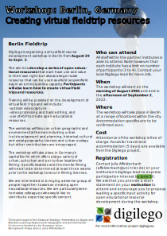

Digilego is hosting its second virtual field course development workshop in Berlin, Germany from August 29th to Sept. 2nd 2022. The aim is to develop a series of open educational resources with a focus on urban geographic and environmental themes that each have use and value in their own right but also as a larger-scale resources that can be used as a field session in an entirely online capacity. Participants will learn how to create virtual field trips and resources.

<!--more-->

See the [Berlin flyer](Berlin_fieldtrip.pdf) for more information.

