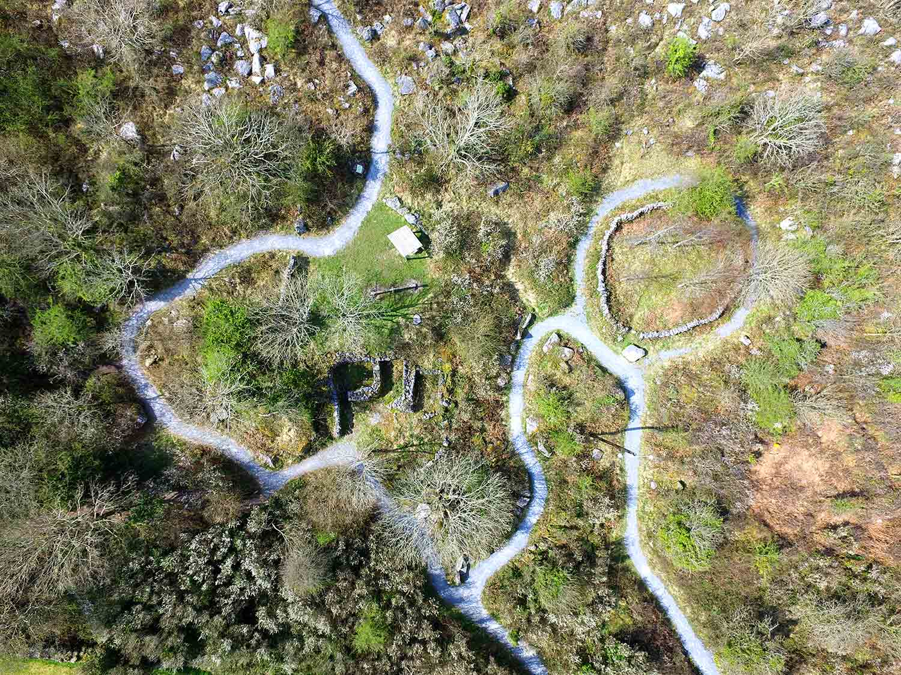

Digilego is hosting a virtual field course
development workshop in the Burren Nature
Sanctuary in near Galway, Ireland, from **June 28th – 30th 2022**.

The aim is to **develop a series of open educa-
tional resources** that each have use and value
in their own right but also as a larger-scale
resource that can be used as a field session/field
day in an entirely online capacity. **Participants
will also learn how to create virtual field
trips and resources.**

Training will be provided on the development of
virtual field trips and will include:

- outdoor video capture
- video processing and basic editing, and
- use of H5P to create open educational resources.

The workshop will focus on ecology, particularly
plant ecology, but will also aim to include
elements of soil science, zoology, tourism and
archaeology.

The workshop will be located in the Burren
Nature Sanctuary (BNS), which is on the edge of
the Burren near a small sea-side town called
Kinvara. The BNS is a conservation area
dedicated to the Burren. Within its 25 acres are a
range of different habitats including a low-
nutrient grassland, woodland and turlough. The
sanctuary also has some animals and is a
popular local tourist destination. You can read
more about the site here:
[www.burrennaturesanctuary.ie](https://www.burrennaturesanctuary.ie)

We are interested in bringing a diverse group of
people together to work at creating what will be
a valuable resource and, although the weather
cannot be guaranteed, the Burren and Kinvara
are both beautiful places to visit.

## Who can attend
All staff within the partner institutes is
able to attend. Note however that
each institute has a limit on number
of participants. Contact your local
Digilego lead for more information.

## When
**Full days of June 28-30, 2022.**

Arrival in area by June 27 and
departure on July 1 or later.
Event starts 9am June 28, 2022.

## Where
The workshop will take place at the
[**Burren Nature Sanctuary**](https://www.burrennaturesanctuary.ie)
, near Kinvara. Kinvara is 40 minutes south
of Galway, Ireland.

## Cost
Attendance of the workshop is free of
charge. Funds for travel and
accommodation (5 days) are available
from the Digilego project.

## Registration
Contact your institution's Digilego
lead to **express your interest in
participating by April 20, 2022**.

We ask that you provide a short
statement on your motivation to
attend and encourage you to propose
leading a relevant training workshop
during the event. The fieldtrip will
have 15-20 participants in total.
