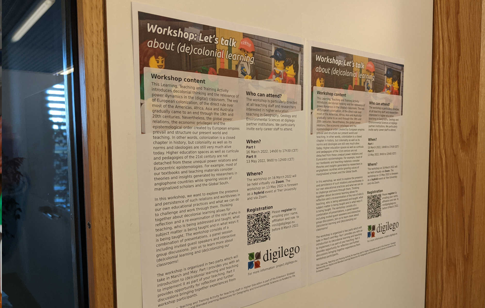

## Let's talk about (de)colonial learning

Interested in teaching and learning in higher education? This workshop will provide you with an introduction to perspectives that allow you to critically think about power dynamics and assumptions in knowledge creation and learning. It will focus on how we can decolonialize our (digital) classroom.

<!--more-->

The workshop is part of the digilego project which seeks to enhance teaching capacity of HE teachers in geography and environmental sciences through training in digital and blended methods delivery and the co-creation of high quality open educational resources. The strategic partnership between Trier University, the University of Hull, the National University of Ireland Galway and the Luxembourg Institute for Socioeconomic Research is co-funded by the EU.
The workshop is directed at higher education teaching staff and those with teaching aspirations. It will feature insights from guest speakers Dr Epifania Amoo-Adare and Dr Eva Bischoff and provide opportunity for discussions and exchange with colleagues across disciplines and partner institutions. 

**For further information, please see ther [flyer](LTTA_decolonising_V5.pdf)**.

To register, please email <a href="mailto:mhill@digilego.eu">Madeleine Hill</a> providing her your name, affiliation and role. 

## Guest speakers

Dr. Amoo-Adare is an independent social science researcher and educator with over 25 years of working experience. Dr. Amoo-Adare holds a PhD in Education from UCLA and is also a RIBA part II qualified architect. Additionally, she has diverse and post-disciplinary interests in areas such as Critical Pedagogy, Critical Spatial Literacy, Cultural Studies, Decoloniality, International Educational Development, Mobility Studies, 'Third World' Feminisms, and Urban Studies. 

Dr. Eva Bischoff is Assistant Professor for International History at the University of Trier, where she teaches classes on Global History, British as well as German Imperial History and Gender History. She obtained her PhD from Ludwig-Maximilians-University in Munich. Dr. Bischoff’s teaching experiences include teaching positions, at the Universities of Cologne, Bonn and Münster, in North American History and Postcolonial Studies. 
