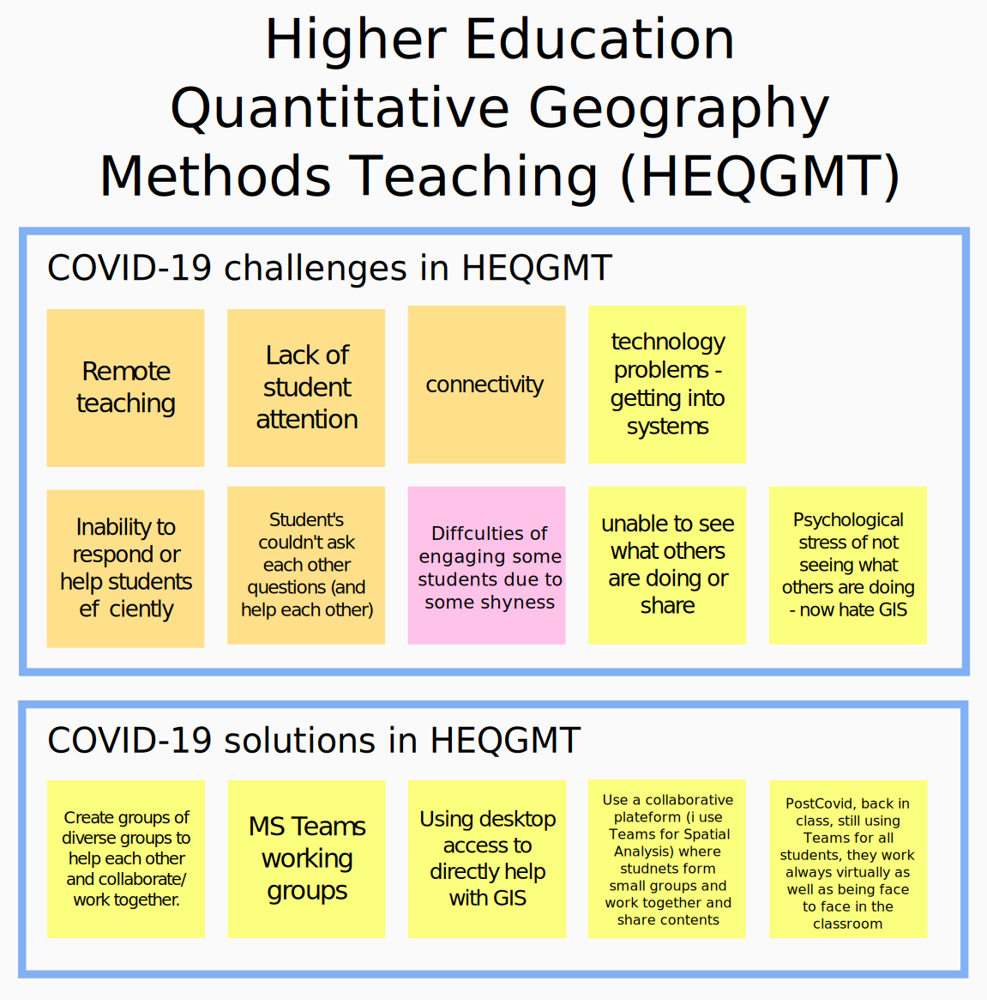
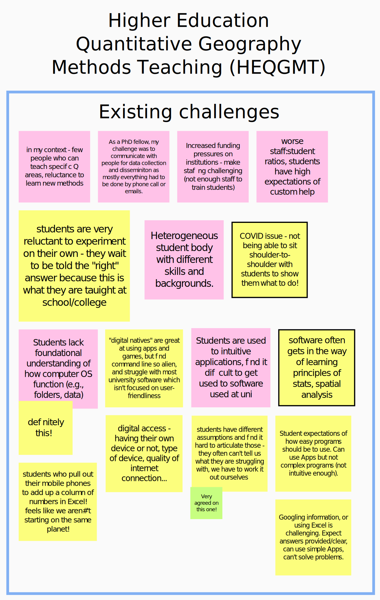
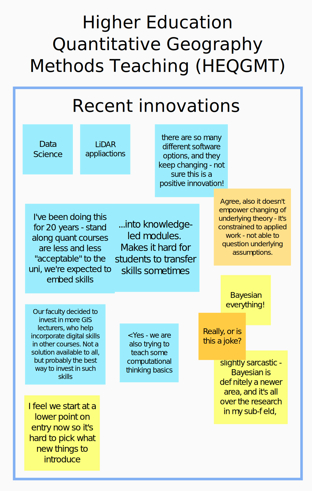
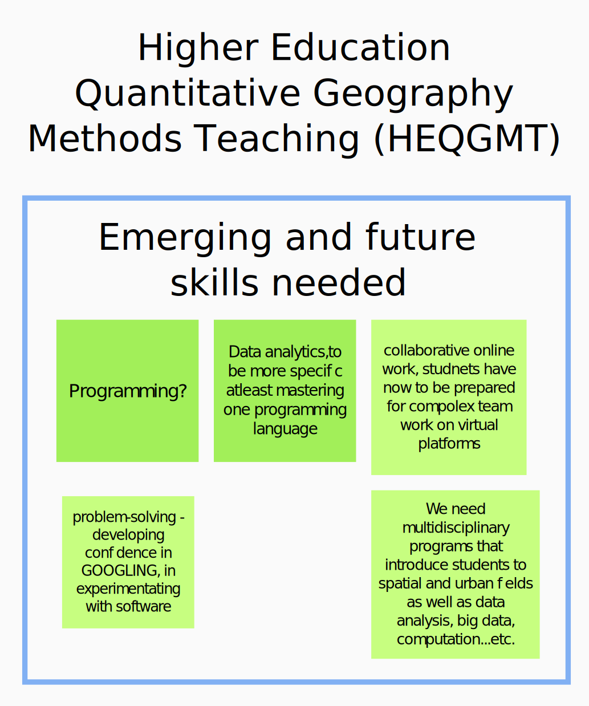

On November 3rd, 2021, at 10am (UK time) the first event of the biennial ECTQG conference started. Digilego hosted a workshop titled "*Facilitating quantitative methods pedagogy: Digitalization, innovation, and future needs*".

The 90 minute workshop, besides an introduction of the Digilego project, focused on discussing what are:

- existing challenges to quantitative geography methods teaching (QGMT) are, during the COVID-19 pandemic but also more generally,
- recent innovations in QGMT have been developed, and
- future and emerging skills requirements.

The workshop, beyond simply having another virtual meeting on the Zoom platform tried to engage in recent virtual meeting innovations. The meeting used [Mural](https://www.mural.co/) and [WorkAdventure](https://workadventu.re/) to provide a collaborative workspace and a spatial virtual meeting room, respectively. For those unfamiliar with WorkAdventure, it's a simple virtual space, think an early 90's role playing computer game, where people can interact with others through the automated creation of video chat rooms based on spatial proximity within a decorated environment of rooms or outdoors spaces. There are other similar platforms to WorkAdventure, such as [Mozilla hubs](https://hubs.mozilla.com/), [Gather](https://www.gather.town/), or [Wonder](https://www.wonder.me/).

We did encounter a few technical and social difficulties in our workshop. To note a few, our Zoom session was inadvertently closed, disconnecting some participants, comprehension of the WorkAdventure platform was more challenging than expected for some participants, and screen sharing within WorkAdventure did not function due to a operating system update.

Despite these challenges, resulting in a smaller group of discussants, we had a lively discussion that covered our desired topics.

The presentation, which was minimal due to a moderation role, can be [viewed full screen](presentation/presentation.html) or is available below (Click on the presentation below and use the right/left arrows to change slides).

<iframe class="w-100" style="height: 350px" src="presentation/presentation.html"></iframe>

## Outcomes

### COVID-19 Challenges to Higher Education Quantitative Geography Methods Teaching (HEQGMT)
We began the workshop with an ice-breaker discussion of the recent challenges related to COVID-19 and solutions.

The shift to remote teaching was challenging for students and staff alike. Participants noted:

- A lack of student attention and focus.
- Many technological problems.
- An inability to effectively or efficiently respond or help students.
- An inability of students to help one-another, either through simple observation (e.g., look at how someone else is doing it) or collaboration.
- Increased stress by students of not knowing where they stand relative to their (in)ability to complete tasks (e.g., Is the instructor not clearly explaining this? Am I the only one who doesn't understand this?).

In all teaching it's hard to assure that students understand the communicated material and/or instructions. Social pressures can make raising your hand and stating you don't understand challenging. Reading the room's unease, can embolden some students to ask questions - this isn't as easy in virtual lessons. Similarly, where methodology exercises in the past geography lessons have been either collaborative or assigned to a collective individually, students were able to help one another and resolve problems - this isn't as easy now.

A clear example of this in my GIS classes is where a student would previously lean over to their neighbour and quietly ask 'How do you do this?', now must ask the whole class, but really the instructor, for help. This causes delays in lessons, an inability to respond to all questions, and a reduction in the curriculum being covered.

Here's the filled out mural board from the exercises.

### Existing challenges of HEQGMT

We then in ernest began discussing the wider challenges in HEQGMT. We wanted to not only focus on instructor challenges, but also student learning, and the types and sources of challenges (e.g., student demand, industry, institutions, funding, training).

A shortage of staff trained in specific needed methods and a willingness (or perhaps availability?) to develop new quantitative geography methods expertise were seen as a problem. Similar outcomes are also noted as being caused by funding pressures and therefore insufficient staff and worsening ratios of staff to students.

Changes in student knowledge and learning ability are also perceived as a problem. Primary and Secondary schooling methods were blamed for providing structured teaching that trained students to expect memorization of 'the' answer rather than a more reasoned, logical, or flexible consideration of possible correct answers based on scaffolded knowledge. This problem is not homogeneous among students however. The students are arriving in HE with more heterogeneous skills and
backgrounds. More unanimous however is that 'digital natives' may be effective App users, such as on a tablet or smartphone, but struggle with software that has more diverse purposes and possibilities and are not contextually guiding the user and not intuitive enough. The use of software then, can become a barrier when used to teach or deepen understanding of quantitative methods.
Finally, participants also suggested that there seems to be a regression in student knowledge of concepts and ability for some basic tasks (e.g., arithmetic) and problem solving (e.g., Googling for a solution). This results in decreased availability, in conjunction with other staffing challenges, to teach more advanced and diverse topics to bachelor students.

Many of the points from the discussion were added to the collaborative mural board (below).

### Changes and innovations in HEQGMT

My BSc Geography research program has not changed much with the exception of active sensors (LiDAR) and web-maps. However, a hybrid CSC and GEOG programs now exists, and is commonly present in other institutions. These provide, in addition to previous methods, greater emphasis on programming, graphics, data science, big data, cloud computing. However these diplomas provide blending within engineering and computing departments.

Harris et al. (2013) in their [report on quantitative geography methods](https://orca.cardiff.ac.uk/59957/) state that instructors believed: "quantitative methods are not well integrated in the geography curricula. At university, stand-alone quantitative courses can give the impression that quantitative methods are not part of the substantive themes of human geography in particular". Similarly, it is not clear how well geographical concepts are integrated into these computing and engineering courses. How are concepts such as Tobler's law and MAUP integrated? By collaborating with other domains, are we losing the spatial aspect? This is perhaps a policy evolution, and not a methodology teaching innovation.

Participants were asked to discuss recent changes HEQMT but also new innovations, and to populate the mural board (below) when doing so.

The added contribution on innovation in this section was mitigated, with the discussion focusing more on policy evolution. A participant noted that there's an administrative push to fold in skills training into knowledge or theoretical modules. Given the increasing rise of different software packages to achieve increasingly complex operations, it appears that this may be hampering student skills development. While we have observed some skills training courses still being common, we have also opposing problem concern regarding the proprietary nature of the complex software that is being taught.
This will provide economic barriers to students to practising their learned methodologies independently of larger companies that can afford the specialized and costly software.

### Future and emerging HEQGMT needs

The discussion was running out of time so we did not have time to fully discuss emerging trends in HEGQMT. Beyond those points we've already mentioned in the previous sections a few points are salient given the perceived degradation of student ability.
The ability of students to need to better problem solve and work collaboratively effectively is, and has perhaps always been in HE, one of the main learning objectives but also now an increasingly emerging need perceived. This is admittedly worrying but something to consider when developing methodology training, and other teaching.

We have tried to break-down the mural results from the workshop into digestible sections in this news post. However, the complete and raw mural from the workshop is [available to download](mural.pdf).

## Conclusion

The workshop was a worthwhile discussion that highlighted not only institutional challenges, such as staffing, but also student qualification and expectations for HE learning. While much of our discussions focused on students from the UK, some of us coming from the Netherlands and Luxembourg, have observed similar trends.

This workshop only scratched the surface of a current a lively debate in the literature that is not only related to recent challenges in teaching due to the COVID-19 crisis [(See Blanford et al., 2021. *LOCKDOWN LESSONS: an international conversation on resilient GI science teaching*)](Blanford_et_2021_Lockdown%20lessons-an%20international%20converstation%20on%20resilient%20GIS%20teaching.pdf) but those that have
been ongoing [(See Wolf
        et al., 2020)](https://journals.sagepub.com/doi/10.1177/0309132520924722).
