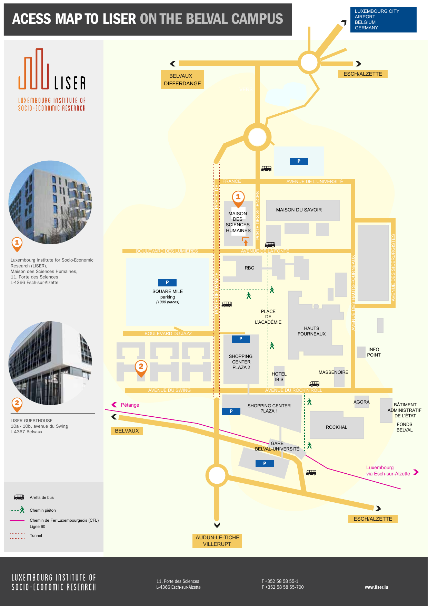
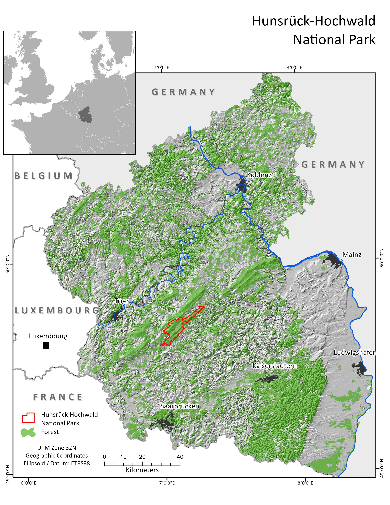

## Digilego Learning, Teaching and Training Workshop, **22-24 May 2023**
**Trier University & Luxembourg Institute of Socioeconomic Research**  

**[Register here](https://www.uni-trier.de/universitaet/fachbereiche-faecher/fachbereich-vi/faecher/nachhaltige-regional-und-standortentwicklung/standard-titel#c381241) - [See programme PDF](Programme_v5.pdf)**  
You can register for individual days.

--- 

### Workshop description
The workshop offers the opportunity to develop and strengthens digital skills for geography and environmental sciences methods teaching including field, qualitative and quantitative methods. The workshop includes field elements and hands on training with selected tools and applications as well as presentations on best practices, experiences and interactive round tables for knowledge exchange and trouble shooting.

The event is part of the Erasmus+ Strategic Partnership on Digital and Blended Learning Resources for Geography and Environmental Sciences co-funded by the European Union.

### Itinerary overview:
**Monday, May 22**: Field methods & training (at Trier University & National Park Hunsrück-Hochwald)  
**Tuesday, May 23**: Open educational resources: Best practices and experiences (at Trier University)  
**Wednesday, May 24**: Training sessions and knowledge exchange on research methods & methods teaching (at LISER)

[Full programme PDF](Programme_v5.pdf)

### Contributions
We are keen to bring together a diverse group of people interested in geography and environmental methods at all levels.
**If you would like to present your work, propose a session or suggest a topic** to be included in the workshop, please either or both:  
[Julia Affolderbach]() (Trier University)  
[Cyrille Médard de Chardon]() (LISER)

### Conference Venues
The workshop will take place at **Trier University** (in Trier, Germany) and the **National Park Hunsrück-Hochwald** (30-minutes east of Trier) on Day 1. Transport between Trier University and the National Park will be provided.  
Day 2 will be held at **Trier University**.  
Day 3 at Luxembourg Institute of Socioeconomic Research, **LISER**, located in **Esch-Belval, Luxembourg**.

### Costs
Attendance of the workshop is **free of charge** and open to participating institutions.

Funds for travel and accommodation (5 days) are available for participants travelling from the two non-hosting partner institutions University of Galway and University of Hull. To apply for funding, please contact the following colleagues:  
University of Hull: [Jane Bunting](m.j.bunting@hull.ac.uk)  
University of Galway: [Karen Bacon](karen.bacon@universityofgalway.ie)

### Registration
**Confirm your attendance by May 14 so that we may assure transport.**  
*Field trip participation on the first day is constrained due to transport limitations.*
Please indicate which days you can or wish to participate:
#### [Register here](https://www.uni-trier.de/universitaet/fachbereiche-faecher/fachbereich-vi/faecher/nachhaltige-regional-und-standortentwicklung/standard-titel#c381241)

### Full Programme

==> [PDF Programme](Programme_v5.pdf) <==

--- 

## Further details

### Workshop Venues
**Trier University**  
Campus II  
Behringstraße 21  
54295 Trier  
Germany

Trier University is located to the East of the city-center on the Petrisberg plateau. The workshop will take place on the smaller of the two campus locations, [Campus II](https://www.uni-trier.de/en/university/directions-contact/campus-maps#c311935).
From the city centre, take bus number 4 ([see schedule here](https://www.swt.de/swt/Integrale?MODULE=Frontend.Media&ACTION=ViewMediaObject&Media.PK=8494&Media.Object.ObjectType=full)) or number 14 ([see schedule here](https://www.swt.de/swt/Integrale?MODULE=Frontend.Media&ACTION=ViewMediaObject&Media.PK=9190&Media.Object.ObjectType=full)) from Porta Nigra or the train station.
Busses leave the Porta Nigra bus station at 14, 28, 44 and 58 minutes past the hour.

Regional transport map:  

Getting to Campus II from Trier, map:  

**Luxembourg Institute of Socio-Economic Research**
Maison des Sciences Humaines  
11, Porte des Sciences  
4366 Esch-sur-Alzette / Belval  
Luxembourg

LISER can be easily accessed from Trier with [Bus 306](https://www.mobiliteit.lu/wp-content/uploads/horaires-new/rgtr/306.pdf?v=20230314) from the Porta Nigra. The bus leaves every hour on the hour and at 30 past during rush hour.

[LISER access map PDF](https://www.liser.lu/doc_viewer.cfm?tmp=40)

### National Park Hunsrück-Hochwald

Map of the destination on Day 1 of the workshop.  
Travel will start from Trier University.

  
Map by Johannes Stoffels

--- 

## Travel to the Trier-Luxembourg region

For international travel (by air) the airport in Luxembourg is the closest and most convenient. Despite public transport being free in Luxembourg you **must buy a ticket** as you are crossing the border (it's only a few Euros).

It has multiple bus connection to Trier:
- Direct with [Bus 302](https://www.mobiliteit.lu/wp-content/uploads/horaires-new/rgtr/302.pdf) (**Monday to Friday** only)
- Two buses [Bus 16](https://www.mobiliteit.lu/wp-content/uploads/horaires-new/avl/16.pdf) to LuxExpo then [Bus 303](https://www.mobiliteit.lu/wp-content/uploads/horaires-new/rgtr/303.pdf)
- Bus to Luxembourg and then taking the bus.

Other airports exist in the region (e.g., Frankfürt Hahn, Frankfürt) but will require longer train or bus rides.

**Local transportation**:

Public transport is free in Luxembourg. If you travel from Luxembourg to Trier or back, you are required to purchase a bus or train ticket for the German part of the trip. Bus tickets can be purchased on the bus, train tickets should be purchased prior to boarding the train.

### Hotels

There are a variety of hotels in Trier and Belval available.

#### Trier

There are plenty of accomodation options in Trier. The following are only a few minutes away from the historic Porta Nigra where busses to the University and to Luxembourg depart from.

- [Paulin Hotel Trier](https://www.hotel-paulin-trier.de/)  
- [Hotel Porta Nigra](https://www.hotel-porta-nigra.de/)  
- [Mercure Hotel Trier Porta Nigra](https://all.accor.com/hotel/5356/index.de.shtml?utm_campaign=seo+maps&utm_medium=seo+maps&utm_source=google+Maps)

#### Luxembourg

You can either choose an accommodation in **Luxembourg City** which provides easy access to the airport or in **Esch-sur-Alzette** *closer* to the workshop venue.
LISER is in **Belval**, also called Belval-Université or Esch-Belval, but not to be confused with the adjacent train station and larger city of **Esch-sur-Alzette**.

If you opt for Luxembourg City, you might want to look for an option in proximity to the train station (the Gare district) to access public transport to Esch-Belval (train station Belval-Université) and Findel Airport. 

The closest hotel next to LISER (and the University of Luxembourg) is the [ibis Esch Belval](https://all.accor.com/ssr/app/ibis/hotels/esch-sur-alzette-luxembourg/index.fr.shtml?).
It is best option if you don't want to worry about getting to the venue which is only a few hundred meters away, but is perhaps not the most interesting part of Luxembourg.

