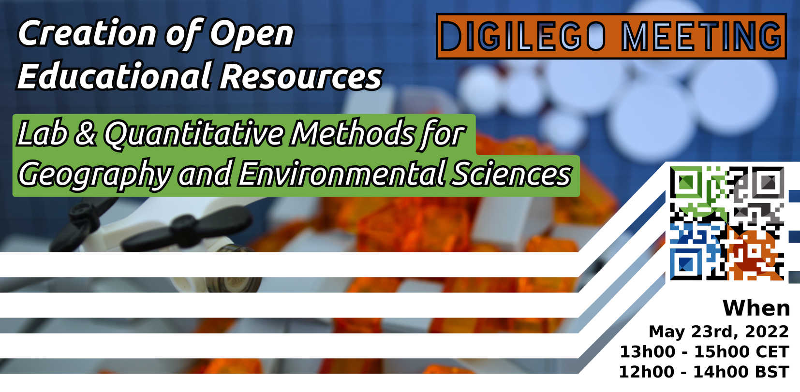

As part of the digilego project's creation of open educational resources (OER) for **LAB and QUANTITATIVE domains** an OER bundle formalization meeting is taking place on **May 23rd** (12h00-14h00 BST & 13h00-15h00 CET).

The meeting will mainly be a summary of who is participating in generating OER, what OER packages/groups/bundles they will be developing, an opportunity to express interest to collaborate with designated OER leads, and potentially a last chance to suggest an additional funded OER contribution.

If you are a member of the four member institutions and interested in the creation of OER for laboratory or quantitative geography or environmental sciences you should get in touch with Jane Bunting (Lab methods lead) or Cyrille Médard de Chardon (Quantitative lead).

Leading up to the meeting date of **May 23rd** Jane and Cyrille will be contact points for those interested in developing specific OER topics or "bundles".
We would like to meet with you individually, virtually or in-person, to discuss what resources are available to you and delineate what OER you would like to lead.

If for some reason you are unable to attend the **May 23rd** meeting this is not a problem as we'll already have an understanding of your interests and desires from our individual meetings.

Please see the [flyer](digilego_ql_deleg_flyer.pdf) detailing further the intent of the meeting.
Disseminate the flyer at your respective institutions and with your colleagues.

The virtual meeting room will be shared with collaborators as the date approaches.

Please get in touch with Jane or Cyrille to setup a meeting regarding lab and quantitative methods OERs that you are interested in developing.
