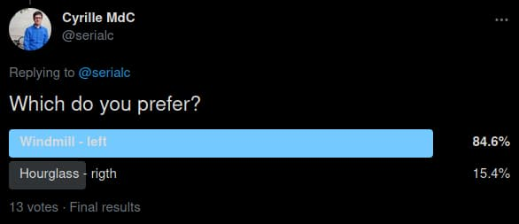

Digilego has chosen a new logo. This turned out to be a longer process than expected.

The final two designs for consideration were the windmill and hourglass designs below.

<!--more-->

Internally we had a bit of a stalemate regarding a final design.
Thankfully the Twitter community quickly settled the discussion:

The results were clear.

The selection of a logo went through many iterations. There were a few guidelines on which we were basing our designs:

- Upbeat / fun
- Colourful
- Had four elements representing the four workpackages

Our final version, with text is below:

There exist a few variants of our logo, such as the symbol only, text of different colours (to handle dark backgrounds), and colour codes if you'd like to match other content to the logo colours.

All the logo variants are available for [download](logo.zip).
