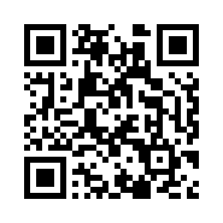
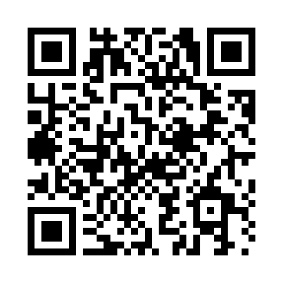

This post provides an example online education resource (OER), which is one of the main output objectives of the digilego project. 

<!--more-->

Within the four geography and environmental science methodology work packages (qualitative, quantitative, field, and lab) of this project, a variety of OER types are being created:


Work package leaders are currently in the process of delegating groups of OER, called bundles, within institutional teams.

This OER serves as an example of a more utilitarian resource, that can be used in a variety of teaching applications. The more you learn about QR codes, the more you understand their potential.

This resource will cover what QR codes are and how they function, how you can make your own, and describe some applications in Geography and Environmental Science applications.




## What are QR codes?

A QR (Quick Response) code is a machine optimized readable symbol as seen below, that can contain data. 



Test the above QR code with your smartphone or tablet's camera to see the data contained within.

Depending on your smartphone, or device, you may need to use the camera app. Some older devices may require using a specific QR code decoding app.

Without even taking a picture the QR code link should appear, which will be activated by clicking on it.

If however the QR code contains just data, such as text in the example below, a specialized app may be necessary. On an Android device you can use Google Lens to see the data contained within any QR code.


The usual app used to decode and utilize a QR code, the camera, is unsure how to proceed with simple text data or other unexpected data formats and therefore does not present you an option to activate it.

Before we proceed, the most important thing to remember is to **always test your generated QR code** before sharing or using it.

Onward!

### QR codes applications

This section explains the underlying concepts of QR codes and explaining why generating them yourself, or carefully selecting an online service, may be worthwhile.

While this QR code explainer and the instructions cover some of the fundamental concepts, a great diversity of barcodes and QR codes exist, so conceptual coverage here is general and focused on using and applying QR codes. Precision will later be used for the steps to actually generate your own QR codes using the [qrcode](https://pypi.org/project/qrcode/) tool.

Why would you want to use a QR code? Typing a URL or website address can be time consuming or even challenging to get right when complex. Additionally, we'll show you some special functions such as sending an email, or how they can be integrated into educational activities and even teaching.

To start, however, let's explore some common applications.

The most common application of QR codes is the providing of a link to an online resource. So, for example, if you want to provide more information regarding an event on a poster, or perhaps about a course on a syllabus, you can add the QR code and people will be directed to the website of interest and the additional information, or even a registration form. 
Depending on how you integrate the URL used by your QR code, you can also use it to carry out online operations, such measure the attention the poster is getting (or at least the QR code uses). This intermittent aspect between the user activiting the QR code from their camera app to the content being revealed allows some powerful possibilities, but also exploitation. We will get to why this is the case soon.


Regardless, integrating QR codes into online interactions can be diverse and powerful by bridging or even tying the physical and virtual. Imagine you or a student has borrowed some surveying gear from the department and you're having problems or need more information, the QR code on the device could link to a variety of additional virtual resources such as tutorials, where to report damage, and document needed maintenance or repair steps. 


#### QR code risks

QR codes make it quick and easy to visit sites, send emails, connect to WiFi networks, open locations in a mapping application and other purposes.
Just like any link provided in an email, or a free WiFi network being available, it's important to double check the validity and security of the action the QR code wants to take.
This means giving a quick look at the URL you are about to be directed to, or considering whether that WiFi is trustworthy, seeing to whom the email will be sent and what information you're sending, etc... 

QR codes are powerful but as a result require a bit of caution in their use.


### Origins

The QR code is an evolution on barcodes that provide additional versatility, data capacity, and robustness. We will explore barcodes first as they are simpler to demonstrate the concepts that are also present in QR codes.

#### Barcodes

The fundamental of a barcode is that numbers are codified into bars and spaces of varied widths, representing different digits or characters, containing quantities of data of different lengths. This allows transforming numbers to easily machine readable symbols - in this case bars of white and black that lasers can scan and transform into digits.


The size of a barcode depends on the amount of data - the package size. Compare the above barcode with the "2022" package to the one below with the "2022-02-10" package.


With no data, or package, a barcode still has some information indicating that data is contained by having particular sequences at the start and end of the barcode. There's also a simple checking mechanism included in the barcode to help the machine check that what was read is (likely) correct. This is meant to prevent a bad reading from being translated into, potentially, another product or price when scanning an item.

There are many [barcode standards](https://en.wikipedia.org/wiki/Barcode). With some also allowing characters.


#### Two dimensional barcodes (QR codes)

The QR code is simply one evolution, of a diversity, of two-dimensional barcodes, which is optimized for scanning by image recognition rather than a photosensor (like at the supermarket). As we'll see, QR codes have some additional features that the traditional barcode does not.

So QR codes, similarly to barcodes, can embed all sorts of data and change in size according to the data quantity.


As we increase the message or data size the QR code become larger:



Unlike barcodes, QR codes can include varying degrees of error correction. This means that if your device's camera does not get a perfect reading or part of the code is occluded/hidden, then the message can still be read. While the above message allows about 7% of the message to be 'lost' and still function, the below example allows 30% of the message to be hidden.


Try obscuring a small portion of the above QR code and see whether you're able to recognize it with your smart phone camera app.

### How QR codes function

There are many, many online services that will convert your data payload into a QR code and even offer you some fancy styling options. Besides being the easiest option for those not yet knowing to generate their own QR codes, there's a few reasons why you may not want to do this.

As we've explained QR codes are just data that your, typically, smart phone will decide what to do with, such as open a valid URL in a browser. Most free QR code generator websites are either trying to advertise to you, simply selling a service, collecting emails, or gathering information on who and how many people are using the QR code you've created. "How are they collecting QR code user information?" you may be asking?

As we showed in the [section](#qr-codes-applications) QR codes, particularly those for URLs, connect to a server, then send back the data requested. However, it's common for online QR services to forward your request. This means that your QR code points to their server, they then look up where they should redirect you, and then send you there to your expected site.

This has a few potential problems. If the service stops operating or starts charging a fee you may then wish you had used a direct URL. Additionally, while you are temporarily 'visiting' their site to retrieve the correct destination, your browser may be sharing some information that may allow tracking or counting of visitors.

These types of QR codes are called **dynamic**, which refers to their benefit, which is that if you have a QR code deployed on, for example, bicycles, documents, posters, etc... you can in the future redirect them to a new page as needed. **Static** QR codes are those that point directly to a URL.

Note that the above applies to QR codes that contain URLs. QR codes can have endless applications.
**The purposes or outcome of a QR code is determined by the QR code reader.**
Our general purpose applications expect certain types of data from QR codes and will try to fullfill those actions if they can understand them, but a specialized app may find purpose in the data contained that another may not.

Fundamentally all QR codes contain strings of characters, digits, etc... The QR code decoder will evaluate the data string and determine the action it should launch. So a data package starting with "https\://" will be sent to the browser, "mailto" to your email app, "WIFI:" to your WiFi connection app, and so on. If no intent can be determined than your QR decoder (i.e., your camera app) will likely do nothing.

## Making QR codes

So you would like to create a QR code.
Many purposes are possible but we will focus on four applications:

* URL: The path to a website - note that you can point to simple URL (e.g., https\://project.digilego.eu) or a complex one that will make the server complete some action (e.g., https\://tool-library.free/hammer15/checkout/). This however requires some work on the server that we will not cover - but keep in mind the potential.
* Data: Such as some text message or longer series of digits or code that take work to copy correctly. This is not ideal as most QR code scanners don't know what to do with simple text. You're likely better off for usability purposes, unfortunately, pointing to a URL that displays the content in a browser.
* Email: You can have a QR code trigger your email program to start an email to a specific address with a subject and even some content already generated - for example to register for an event.
* WiFi: Perhaps you're having an event and want to provide WiFi? You can encode connection information in a QR code.
* Geolocation: A QR code can contain a latitude and longitude that will be opened by your mapping app. This can be used to provide the location for a sampling exercise, or where an event is located, rather than using an address, or if no address exists.

### 'Free' services

The QR codes that some websites provide operate much like URL shorteners (e.g., shorturl.at, cutt.ly) where the URL you ask to point to will be redirected through another website. So if I provide a URL (https\://project.digilego.eu) to qrstuff.com they will provide me a QR code that points to <https://qrs.ly/j2dgirz>. Their server then redirects me to my desired site.
During this 'visit' to qrs.ly, through the QR code, visits can be counted and other tracking identifiers could be harvested, such as social network identifiers.
As mentioned earlier, if the website or service were to shutdown the QR code would no longer function.

The trade-off of this service is the ability to use dynamic redirection.
This may be practical in situations where you are unable to provide redirection on your own site.
While we do not cover it here, it is something you can also control yourself if you have a server.

Depending on your use and capabilities you may find that online services provide adequate tradeoffs.
However if you're simply looking to generate a static QR code (without going through a service and the possible negative aspects) we can (as of writing) recommend <https://goqr.me/>.
Similarly if you're looking to generate a WiFi connection code take a look at <https://qifi.org/>.

However, if you would like to learn how to generate your own QR codes, please continue on to the next section. 

### Purposes

We'll be using the [Python QR code library](https://github.com/lincolnloop/python-qrcode) to generate QR codes locally.

We do *not* cover here how to install the library as other resources exist that will be specific to your operating system and more up to date. There is some installation information on the [Python Package Index](https://pypi.org/project/qrcode/). Please note however that the Pillow package, to generate images, is also needed - as detailed in the installation instructions.

#### Data

The QR code library is a stand-alone tool that can also be used from within Python scripts (e.g., to automate the generation of a large quantity of QR codes).
The simplest method to create individual QR codes is from the command line however:


  qr "Easy"


This displays the QR code directly in the console/terminal, but does not generate an image file.
In the Mac or Linux terminal we can direct the output into a file:


qr "Easy" > easy.png



We have created a QR code! This simple methodology will cover most applications of QR code use.
Simply replace your "Easy" payload with something else and see how the QR code changes.

Remember to test them with your smartphone before printing or sharing them!

#### URL

Following from above we can use the same process to create a link to a website and save it as an image:


qr "https://project.digilego.eu" > digilego_qrcode.png 


Alternatively, we can do this as a [Python script](https://pythonbasics.org/execute-python-scripts/):


import qrcode

qr = qrcode.make('https://project.digilego.eu')
qr.save('url.png')


This will generate the QR code in the image file named **url.png**.

#### Email

To have a QR code launch the user's email application the QR code data must start with "mailto:" followed by an email and optionally a subject and body.

Generating one from the command line again, is simple:

qr "mailto:jack@hotelmail.com?subject=QR codes are amazing&body=This QR code is generating an email" > email_qrcode.png
# see hidden code/content by scrolling or panning right


However, you can even better formulate the body of the message by using newlines, and these function more easilty by using a Python script:


import qrcode

payload = 'mailto:reservation@geography.com?subject=Trip reservation&body=Dear Geog\n\nPlease find below my registration information.\nName:\nRole:\nInstitution:'

qr = qrcode.make(payload)
qr.save('qrcode_email_reservation.png')


The "\n" in the payload are for new lines.
Also note the use of the special characters (:, ?, &, =) in the basic payload syntax below: 

```
mailto:[email address]?subject=[subject text]&body=[body text]
```

These symbols are not interchangable.

Test out the resulting QR code from the Python code above:


#### WiFi registration

Like the email example above, WiFi registration requires that the data contain a specific prefix. The start of a WiFi configuration message must contain "WIFI:". What follows is more systematic than for the email QR code, containing key and value pairs.

* Each key and value are separated by a ':' (colon)
* Each key:value pair is separated by a ';' (semi-colon)

The keys are S, T, P, and H, meaning SSID, type of WiFi encryption, password, and hidden, respectively. Note that two semi-colons (;;) end the message.

The possible values for the inputs are the following (bars "|" indicate OR):

```
WIFI:S:<SSID>;T:<WEP|WPA|blank>;P:<PASSWORD>;H:<true|false|blank>;;
```

An example:

```
WIFI:S:CptnCrunch;T:WPA;P:WithMilkPlease;H:false;;
```

Now using this to generate a QR code.


qr "WIFI:S:CptnCrunch;T:WPA;P:WithMilkPlease;H:false;;" > WiFi_qrcode.png


You can of course replace the data payload into the Python script as done for the URL example above if you prefer:


import qrcode

qr = qrcode.make('WIFI:S:CptnCrunch;T:WPA;P:WithMilkPlease;H:false;;')
qr.save('url.png')


#### Geographic location

Another QR code that will activate other apps from the camera, like the email example, is the `geo:` tag that prefixes a latitude and longitude.

For locations you formulate the location as:

```
geo:latitude,longitude
```

We can directly generate a QR code that will open in your mapping application, in this case pointing to Vancouver, Canada.


qr "geo:49.2827,-123.1207" > qrcode_yvr.png


You can test the result below.


### Formats

For many purposes exporting the QR code as a png is sufficient.

For some applications however you may prefer to export the QR code in vector format. It can then be resized or further modified in a vector graphics editor (e.g., InkScape) without it becoming grainy or blurry. This is what the SVG (Scalable Vector Graphics) format is for.

You can easily change the export method by using the "--factory=svg-path" parameter and updating the output filename extension:


qr --factory=svg-path "Some text" > test.svg


Doing the same in a Python requires a few more lines:


import qrcode
import qrcode.image.svg

payload = 'This is an SVG file'
img = qrcode.make(payload, image_factory=qrcode.image.svg.SvgPathImage)
img.save("qrcode.svg")



The Python QR library creators provide further details on how to [create an SVG using a Python script](https://github.com/lincolnloop/python-qrcode#svg).

### Styling

There are many additional functions for styling QR codes within the Python package, however, for many it may be simpler to modify the styling in a graphics editor rather than use the existing library.

Remember that you can do things such as change colours, merge designs, or even hide parts of the QR code and it should still function. Here's an examples of a logo embedded into a QR code:


In the case that someone wishes to automate the styling of a batch of QR codes it's likely that the existing [documentation](https://github.com/lincolnloop/python-qrcode#styled-image) is a better resource to draw on.

## Using QR codes

The most common application of QR codes is simply providing an easy way for people to be directed to a website. Recently this has meant using a digital menu at a restaurant. While we've become most familiar with QR codes with vaccination certificates, these are typically custom data, that require a special app to decode them - to make sense of the information.

In this section we will list some applications of standard QR code functions, rather than those that require specialized apps.

When thinking of applications of QR codes, keep in mind a few aspects:

- The coded or concealed nature of data within a QR code allows for certain specific interactions (e.g., select the QR code for the correct answer and a specific information why this is wrong or correct). 
- The quantity of data that can be contained in a QR code directly or indirectly through a website.
- The types of interactions possible, such as geolocation, URL, WiFi, etc...
- Making easy the dissemination or sharing of data that may be hard to correctly copy by hand (e.g., a phone number, password, or URL) particularly when people don't have the capability, time, or willingness to copy it down (e.g., smart phones have created the problem that many people no longer carry a pencil or pen and paper with them).

### Events

QR codes are great on posters and ticket, allowing people to get more information or be 'check-in'/counted by scanning attendants' tickets at the door. They can also be used during the event to provide directions (see the geolocation function described above), schedules, calendar events, or easily connecting to WiFi.

### Classroom engagement

In many contexts we no longer need to encourage more digital content, however QR codes can be used in interactive activities that engage. With a little effort you could have students move through space, potentially outdoor, in orienteering or treasure hunt activities that are daisy chained by QR codes.

I've seen some interesting uses of QR codes linking to student book reviews. This goes back to linking the physical to the virtual, but providing social content that can also encourage the development of writing skills. In the context of higher education, perhaps student maps from a cartography course can contain QR codes providing links to methodological backgrounds.

For field work, students could be directed to various sites using the geolocation QR code functionality tied to a schedule. Additionally, but not covered here, you can attach contact details (Vcard) within a QR code, making contact information of the activity leaders available to all participants easily (in addition to in text format and other formats as needed).

### Other QR code abilities

In closing, keep in mind that we have presented some of the types of QR codes and that others are supported, such as sending SMS messages, calling a phone number, and adding an event to a calendar. New functionalities may become available over time as well.
